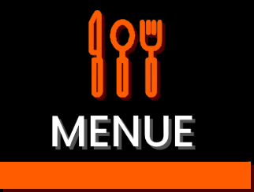

# Projeto - Menue
## Cadastre seu cardápio On-line!

### Sobre o projeto
Menue é um projeto pessoal que consiste em uma aplicação completa, com o front e o back end. Nela, o proprietário de um estabelecimento alimentício pode cadastrar seu cardápio para que seus clientes possam acessar virtualmente.

O propósito é tornar mais prático o acesso ao cardápio, onde o cliente pode buscar os itens dentro do estabelecimento ou até mesmo em sua residência, facilitando assim o pedido que não depende de solicitar um cardápio e aguardar a resposta do atendente. Sendo assim, o cardápio fica disponível 24 horas por dia, independente se o estabelecimento está aberto ou não.

A aplicação é TOTALMENTE responsiva, então, tanto restaurante quanto o cliente pode acessar o cardápio através do dispositivo de sua preferência.

Veja as fotos da aplicação no fim do readme ou dentro da pasta "screenshots".

### Tecnologias utilizadas
**Back-end:**
- NodeJS;
- Linguagem: Typescript;
- Banco de Dados: Postgres;
- ORM: TypeORM;
- Cache: Redis;
- Testes Automatizados;
- ESLint e Prettier;
- Documentação dos códigos em inglês;
- Docker (Veja os comandos para instalar os containers na pasta "to_start" na raiz do projeto).

Na pasta "server" contem todo o back-end da aplicação.

**Front-end:**
- ReactJS (Todas as páginas são responsivas);
- Linguagem: Typescripty;
- Estilos: Styled Components;
- Testes Automatizados;
- ESLint e Prettier;
- Documentação dos códigos em inglês.

Na pasta "web" contem todo o front-end da aplicação.

### Para Rodar:

Com o Docker instalado, acesse a pasta "to_start" e abra o arquivo "README.md", siga o passo a passo para instalar os containers da forma correta.

Em seguida, com o terminal aberto dentro da pasta "web" do projeto, instale as dependências do front-end, depois abra na pasta "server" e repita a ação para o back-end.

Crie seu arquivo de variáveis ambiente (.env) na pasta "server", seguindo o arquivo de exemplo ".env.example" que se encontra nesta mesma pasta.

Por fim, basta abrir um terminal na pasta "server" e rodar o script "server", e com outro terminal rodar o script "start" dentro da pasta "web".

### Screenshots Web Desktop

[Web-Desktop](screenshots/web_desktop/)

### Screenshots Web Mobile

[Web-Mobile](screenshots/web_mobile/)
